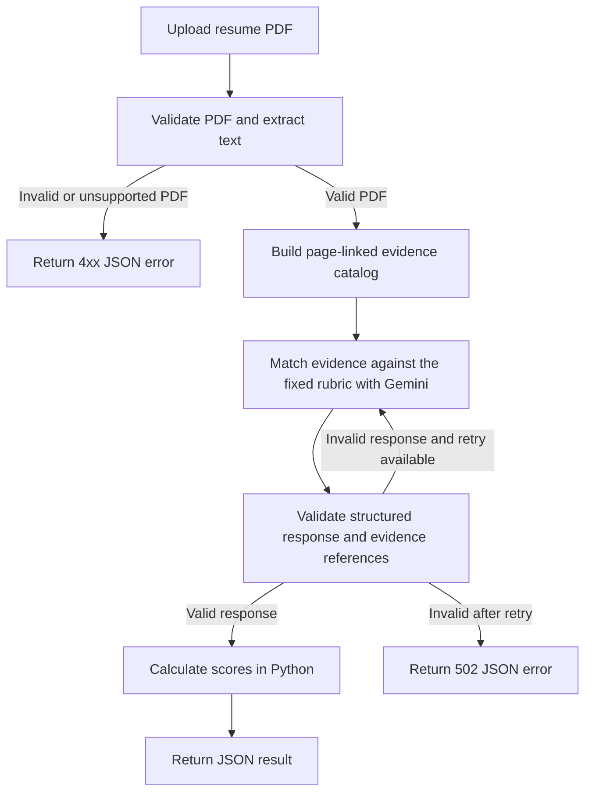

# Resume Matching API

This project implements the resume-analysis coding assignment for the AI & Data Solution role. It accepts a PDF resume and returns a JSON result with an overall score, category scores, Thai explanations, and the resume evidence used for each criterion.

Built with Python, FastAPI, Pydantic, pypdf, and Gemini 3.5 Flash-Lite.

## Processing flow



Python creates the evidence catalog before the LLM call, so every evidence item has a stable ID, page number, and verified quote from the extracted resume text. Gemini receives this catalog and the fixed rubric instead of the original PDF. A valid response normally uses one Gemini request; invalid structured output can be retried once.

## Scoring

| Category | Points |
|---|---:|
| Experience | 30 |
| Skills | 25 |
| Knowledge | 20 |
| Tools and technologies | 20 |
| Education | 5 |

Gemini assigns an evidence level from 0 to 4 for each of the 20 criteria. Python calculates the score with `criterion weight × evidence level ÷ 4`.

| Level | Meaning |
|---:|---|
| 0 | No supporting evidence |
| 1 | Mentioned or studied |
| 2 | Applied in training or a personal project |
| 3 | Applied in professional work or a clearly scoped project |
| 4 | Strong professional evidence with ownership, depth, or measurable impact |

| Score | Match band |
|---:|---|
| 85–100 | `STRONG_MATCH` |
| 70–<85 | `MATCH` |
| 50–<70 | `PARTIAL_MATCH` |
| 0–<50 | `LOW_MATCH` |

## Run locally

Requirements: Python 3.13, [uv](https://docs.astral.sh/uv/), and a Gemini API key.

```bash
cp .env.example .env
uv sync --frozen
uv run uvicorn resume_matcher.main:app --reload
```

Set `GEMINI_API_KEY` in `.env`, then open [Swagger UI](http://127.0.0.1:8000/docs).

Send a resume to the API:

```bash
curl -X POST http://127.0.0.1:8000/v1/resume-analyses \
  -F "file=@resume.pdf;type=application/pdf"
```

The endpoint accepts one unencrypted PDF up to 10 MB and 20 pages. Image-only PDFs return `422` because OCR is not included. A sample response is available in [`examples/analysis_result.example.json`](examples/analysis_result.example.json).

## Docker

```bash
docker build -t resume-matcher .
docker run --rm -p 8000:8000 --env-file .env resume-matcher
```

The container runs as a non-root user and provides a `/health` endpoint.

## Tests

```bash
uv run ruff check src tests scripts
uv run ruff format --check src tests scripts
uv run mypy
uv run pytest -m "not integration and not evaluation" --cov
```

Live evaluation tests cover different match levels and difficult evidence cases. They are opt-in because they consume Gemini quota.

```bash
uv run --env-file .env pytest tests/test_live_gemini.py -m evaluation -v
```

To save an API response for the email attachment:

```bash
uv run python scripts/save_analysis_result.py /absolute/path/to/resume.pdf
```

The default output is `private/analysis-result.json`, which is excluded from Git.

## Limitations

- The API uses the fixed AI & Data Solution rubric and supports text-extractable PDFs only.
- The API does not store uploaded resumes or generated results.
- The output is intended to support human review, not make a hiring decision.
